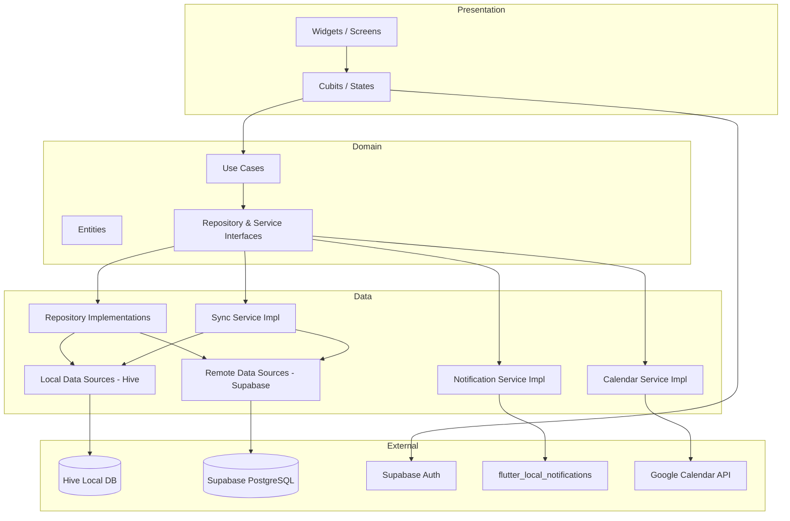

# Design Document: Eye Health Manager

## Overview

Eye Health Manager is a Flutter mobile application targeting iOS and Android. It helps users with refractive eye conditions manage glasses prescriptions, track contact lens expiry, take quick in-app vision tests, and integrate lens replacement reminders with Google Calendar.

The app is architected as a portfolio showcase applying Clean Architecture, TDD, BLoC/Cubit state management, go_router navigation, and offline-first storage. Data is stored locally in Hive and synced to Supabase (PostgreSQL) when online. Supabase Auth handles Google Sign-In and Apple Sign-In. A `SyncService` pushes pending local changes to Supabase when connectivity is restored and pulls remote data on first sign-in from a new device. Conflict resolution uses last-write-wins based on the `updatedAt` timestamp present on all entities.

---

## Architecture

### High-Level Architecture



### Clean Architecture Layer Breakdown

```
lib/
├── main.dart
├── injection.dart                  # get_it + injectable setup
├── app.dart                        # MaterialApp + go_router
│
├── core/
│   ├── error/
│   │   ├── failures.dart
│   │   └── exceptions.dart
│   ├── usecases/
│   │   └── usecase.dart            # abstract UseCase<Type, Params>
│   └── utils/
│       └── date_utils.dart
│
├── domain/
│   ├── entities/
│   │   ├── prescription.dart
│   │   ├── eye_measurement.dart
│   │   ├── contact_lens.dart
│   │   ├── eyewear.dart
│   │   ├── vision_test.dart
│   │   └── user_profile.dart
│   ├── repositories/
│   │   ├── prescription_repository.dart
│   │   ├── lens_repository.dart
│   │   ├── eyewear_repository.dart
│   │   ├── vision_test_repository.dart
│   │   ├── profile_repository.dart
│   │   └── auth_repository.dart
│   ├── services/
│   │   ├── notification_service.dart
│   │   ├── calendar_service.dart
│   │   ├── sync_service.dart
│   │   ├── auth_service.dart
│   │   └── connectivity_service.dart
│   └── usecases/
│       ├── prescription/
│       │   ├── get_prescriptions.dart
│       │   ├── save_prescription.dart
│       │   ├── update_prescription.dart
│       │   └── delete_prescription.dart
│       ├── lens/
│       │   ├── get_lenses.dart
│       │   ├── save_lens.dart
│       │   └── delete_lens.dart
│       ├── eyewear/
│       │   ├── get_eyewear.dart
│       │   ├── save_eyewear.dart
│       │   └── delete_eyewear.dart
│       ├── vision_test/
│       │   ├── get_vision_tests.dart
│       │   └── save_vision_test.dart
│       ├── profile/
│       │   ├── get_profile.dart
│       │   └── update_profile.dart
│       └── auth/
│           ├── sign_in_with_google.dart
│           ├── sign_in_with_apple.dart
│           ├── sign_out.dart
│           └── get_current_user.dart
│
├── data/
│   ├── models/
│   │   ├── prescription_model.dart
│   │   ├── eye_measurement_model.dart
│   │   ├── contact_lens_model.dart
│   │   ├── eyewear_model.dart
│   │   ├── vision_test_model.dart
│   │   └── user_profile_model.dart
│   ├── datasources/
│   │   ├── prescription_local_datasource.dart
│   │   ├── prescription_remote_datasource.dart
│   │   ├── lens_local_datasource.dart
│   │   ├── lens_remote_datasource.dart
│   │   ├── eyewear_local_datasource.dart
│   │   ├── eyewear_remote_datasource.dart
│   │   ├── vision_test_local_datasource.dart
│   │   ├── vision_test_remote_datasource.dart
│   │   ├── profile_local_datasource.dart
│   │   └── profile_remote_datasource.dart
│   ├── repositories/
│   │   ├── prescription_repository_impl.dart
│   │   ├── lens_repository_impl.dart
│   │   ├── eyewear_repository_impl.dart
│   │   ├── vision_test_repository_impl.dart
│   │   ├── profile_repository_impl.dart
│   │   └── auth_repository_impl.dart
│   └── services/
│       ├── notification_service_impl.dart
│       ├── calendar_service_impl.dart
│       ├── sync_service_impl.dart
│       └── connectivity_service_impl.dart
│
└── presentation/
    ├── router/
    │   └── app_router.dart
    ├── auth/
    │   ├── cubit/
    │   │   ├── auth_cubit.dart
    │   │   └── auth_state.dart
    │   └── screens/
    │       └── sign_in_screen.dart
    ├── home/
    │   ├── cubit/
    │   │   ├── home_cubit.dart
    │   │   └── home_state.dart
    │   └── screens/
    │       └── home_screen.dart
    ├── prescription/
    │   ├── cubit/
    │   │   ├── prescription_cubit.dart
    │   │   └── prescription_state.dart
    │   └── screens/
    │       ├── prescription_list_screen.dart
    │       ├── prescription_detail_screen.dart
    │       └── prescription_form_screen.dart
    ├── lens/
    │   ├── cubit/
    │   │   ├── lens_cubit.dart
    │   │   └── lens_state.dart
    │   └── screens/
    │       ├── lens_list_screen.dart
    │       └── lens_detail_screen.dart
    ├── eyewear/
    │   ├── cubit/
    │   │   ├── eyewear_cubit.dart
    │   │   └── eyewear_state.dart
    │   └── screens/
    │       ├── eyewear_list_screen.dart
    │       └── eyewear_detail_screen.dart
    ├── vision_test/
    │   ├── cubit/
    │   │   ├── vision_test_cubit.dart
    │   │   └── vision_test_state.dart
    │   └── screens/
    │       └── vision_test_screen.dart
    └── profile/
        ├── cubit/
        │   ├── profile_cubit.dart
        │   └── profile_state.dart
        └── screens/
            └── profile_screen.dart
```

---

## Components and Interfaces

### Repository Interfaces (Domain Layer)

```dart
// domain/repositories/prescription_repository.dart
abstract class PrescriptionRepository {
  Future<List<Prescription>> getPrescriptions();       // ordered by issueDate desc
  Future<void> savePrescription(Prescription p);
  Future<void> updatePrescription(Prescription p);
  Future<void> deletePrescription(String id);
  Future<void> syncPendingChanges();
}

// domain/repositories/lens_repository.dart
abstract class LensRepository {
  Future<List<ContactLens>> getLenses();               // ordered by expiryDate asc
  Future<void> saveLens(ContactLens lens);
  Future<void> deleteLens(String id);
  Future<void> syncPendingChanges();
}

// domain/repositories/eyewear_repository.dart
abstract class EyewearRepository {
  Future<List<Eyewear>> getEyewear();
  Future<void> saveEyewear(Eyewear eyewear);
  Future<void> deleteEyewear(String id);
  Future<void> syncPendingChanges();
}

// domain/repositories/vision_test_repository.dart
abstract class VisionTestRepository {
  Future<List<VisionTest>> getTests();                 // ordered by timestamp desc
  Future<void> saveTest(VisionTest test);
  Future<void> syncPendingChanges();
}

// domain/repositories/profile_repository.dart
abstract class ProfileRepository {
  Future<UserProfile> getProfile();
  Future<void> saveProfile(UserProfile profile);
  Future<void> syncPendingChanges();
}

// domain/repositories/auth_repository.dart
abstract class AuthRepository {
  Future<UserProfile> signInWithGoogle();
  Future<UserProfile> signInWithApple();
  Future<void> signOut();
  Future<UserProfile?> getCurrentUser();
  Stream<UserProfile?> get authStateStream;
}
```

### Service Interfaces (Domain Layer)

```dart
// domain/services/notification_service.dart
abstract class NotificationService {
  Future<bool> requestPermission();
  Future<void> scheduleExpiryNotification(ContactLens lens);
  Future<void> cancelNotification(String lensId);
}

// domain/services/calendar_service.dart
abstract class CalendarService {
  Future<void> signIn();
  Future<void> signOut();
  Future<String> createEvent(ContactLens lens);        // returns eventId
  Future<void> deleteEvent(String eventId);
  Stream<CalendarAuthState> get authStateStream;
}

// domain/services/auth_service.dart
abstract class AuthService {
  Future<UserProfile> signInWithGoogle();
  Future<UserProfile> signInWithApple();
  Future<void> signOut();
  Future<UserProfile?> getCurrentUser();
  Stream<UserProfile?> get authStateStream;
}

// domain/services/sync_service.dart
abstract class SyncService {
  /// Pushes all pending local changes to Supabase and resolves conflicts
  /// using last-write-wins based on updatedAt.
  Future<void> syncPendingChanges();

  /// Pulls all remote data for the authenticated user into local Hive storage.
  /// Used on first sign-in from a new device.
  Future<void> pullRemoteData();
}

// domain/services/connectivity_service.dart
abstract class ConnectivityService {
  Future<bool> isOnline();
  Stream<bool> get connectivityStream;
}
```

### Use Cases

Each use case extends `UseCase<ReturnType, Params>` and exposes a single `call()` method, keeping the domain layer free of framework dependencies.

| Use Case | Input | Output |
|---|---|---|
| `GetPrescriptions` | `NoParams` | `List<Prescription>` |
| `SavePrescription` | `Prescription` | `void` |
| `UpdatePrescription` | `Prescription` | `void` |
| `DeletePrescription` | `String id` | `void` |
| `GetLenses` | `NoParams` | `List<ContactLens>` |
| `SaveLens` | `ContactLens` | `void` |
| `DeleteLens` | `String id` | `void` |
| `GetEyewear` | `NoParams` | `List<Eyewear>` |
| `SaveEyewear` | `Eyewear` | `void` |
| `DeleteEyewear` | `String id` | `void` |
| `GetVisionTests` | `NoParams` | `List<VisionTest>` |
| `SaveVisionTest` | `VisionTest` | `void` |
| `GetProfile` | `NoParams` | `UserProfile` |
| `UpdateProfile` | `UserProfile` | `void` |
| `SignInWithGoogle` | `NoParams` | `UserProfile` |
| `SignInWithApple` | `NoParams` | `UserProfile` |
| `SignOut` | `NoParams` | `void` |
| `GetCurrentUser` | `NoParams` | `UserProfile?` |

### Cubit / State Definitions

```dart
// PrescriptionCubit states
sealed class PrescriptionState {
  const PrescriptionState();
}
class PrescriptionInitial extends PrescriptionState {}
class PrescriptionLoading extends PrescriptionState {}
class PrescriptionLoaded extends PrescriptionState {
  final List<Prescription> prescriptions;
}
class PrescriptionValidationError extends PrescriptionState {
  final String field;
  final String message;
}
class PrescriptionError extends PrescriptionState {
  final String message;
}

// LensCubit states (mirrors PrescriptionState pattern)
sealed class LensState { ... }
class LensInitial extends LensState {}
class LensLoading extends LensState {}
class LensLoaded extends LensState { final List<ContactLens> lenses; }
class LensValidationError extends LensState { final String field; final String message; }
class LensError extends LensState { final String message; }

// VisionTestCubit states
sealed class VisionTestState { ... }
class VisionTestInitial extends VisionTestState {}
class VisionTestLoading extends VisionTestState {}
class VisionTestLoaded extends VisionTestState {
  final List<VisionTest> tests;
  final String filter; // "All" | "Week" | "Month"
}
class VisionTestInProgress extends VisionTestState {
  final int currentStep; // 1-3
}
class VisionTestError extends VisionTestState { final String message; }

// EyewearCubit states
sealed class EyewearState { ... }
class EyewearInitial extends EyewearState {}
class EyewearLoading extends EyewearState {}
class EyewearLoaded extends EyewearState { final List<Eyewear> eyewear; }
class EyewearValidationError extends EyewearState { final String field; final String message; }
class EyewearError extends EyewearState { final String message; }

// ProfileCubit states
sealed class ProfileState { ... }
class ProfileInitial extends ProfileState {}
class ProfileLoading extends ProfileState {}
class ProfileLoaded extends ProfileState { final UserProfile profile; }
class ProfileError extends ProfileState { final String message; }

// AuthCubit states
sealed class AuthState { ... }
class AuthInitial extends AuthState {}
class AuthLoading extends AuthState {}
class AuthAuthenticated extends AuthState { final UserProfile user; }
class AuthUnauthenticated extends AuthState {}
class AuthError extends AuthState { final String message; }

// HomeCubit state (aggregates data for dashboard)
class HomeState {
  final UserProfile? profile;
  final Prescription? latestPrescription;
  final ContactLens? nearestExpiringLens;
  final List<Eyewear> eyewear;
  final List<CalendarEvent> upcomingEvents;
  final bool isLoading;
  final String? error;
}
```

### Navigation (go_router)

```dart
// presentation/router/app_router.dart

final router = GoRouter(
  initialLocation: '/home',
  redirect: (context, state) {
    // Route guard: unauthenticated users are redirected to sign-in (req 11.3)
    final isAuthenticated = getIt<AuthCubit>().state is AuthAuthenticated;
    final isSignInRoute = state.matchedLocation == '/sign-in';
    if (!isAuthenticated && !isSignInRoute) return '/sign-in';
    if (isAuthenticated && isSignInRoute) return '/home';
    return null;
  },
  errorBuilder: (context, state) => const HomeScreen(), // req 5.4
  routes: [
    GoRoute(path: '/sign-in', name: 'signIn', builder: ...),
    StatefulShellRoute.indexedStack(   // Bottom Navigation Bar shell
      builder: (context, state, shell) => ScaffoldWithNavBar(shell: shell),
      branches: [
        StatefulShellBranch(routes: [
          GoRoute(path: '/home', name: 'home', builder: ...),
        ]),
        StatefulShellBranch(routes: [
          GoRoute(path: '/quick-eye-test', name: 'quickEyeTest', builder: ...),
        ]),
        StatefulShellBranch(routes: [
          GoRoute(
            path: '/eyewear', name: 'eyewearList', builder: ...,
            routes: [
              GoRoute(path: ':id', name: 'eyewearDetail', builder: ...),
              GoRoute(path: 'new', name: 'eyewearForm', builder: ...),
            ],
          ),
          GoRoute(
            path: '/lenses', name: 'lensList', builder: ...,
            routes: [
              GoRoute(path: ':id', name: 'lensDetail', builder: ...),
              GoRoute(path: 'new', name: 'lensForm', builder: ...),
            ],
          ),
          GoRoute(
            path: '/prescriptions', name: 'prescriptionList', builder: ...,
            routes: [
              GoRoute(path: ':id', name: 'prescriptionDetail', builder: ...),
              GoRoute(path: 'new', name: 'prescriptionForm', builder: ...),
              GoRoute(path: ':id/edit', name: 'prescriptionEdit', builder: ...),
            ],
          ),
        ]),
        StatefulShellBranch(routes: [
          GoRoute(path: '/profile', name: 'profile', builder: ...),
        ]),
      ],
    ),
    GoRoute(path: '/settings', name: 'settings', builder: ...),
    GoRoute(path: '/notifications', name: 'notifications', builder: ...),
  ],
);
```

Deep link from notification tap: `/lenses/:id` — handled by `flutter_local_notifications` payload parsed in `onDidReceiveNotificationResponse`.

---

## Data Models

### Domain Entities

```dart
// domain/entities/eye_measurement.dart
class EyeMeasurement {
  final double sphere;    // -30.00 to +30.00, step 0.25
  final double cylinder;  // -10.00 to +10.00, step 0.25
  final int axis;         // 0-180 degrees
  final double addition;  // 0.00 to +4.00, step 0.25
  final double pd;        // 40-80 mm, step 0.5
}

// domain/entities/prescription.dart
class Prescription {
  final String id;
  final String label;
  final DateTime issueDate;
  final EyeMeasurement rightEye;  // OD
  final EyeMeasurement leftEye;   // OS
  final DateTime updatedAt;       // used for sync conflict resolution
}

// domain/entities/contact_lens.dart
class ContactLens {
  final String id;
  final String label;
  final DateTime openingDate;
  final int lifespanDays;         // valid: 1, 7, 14, 30, 90
  final DateTime expiryDate;      // openingDate + lifespanDays
  final String? calendarEventId;  // null if not synced
  final DateTime updatedAt;       // used for sync conflict resolution
}

// domain/entities/eyewear.dart
class Eyewear {
  final String id;
  final String label;
  final Prescription prescription;
  final List<String> visionTestIds;
  final DateTime updatedAt;       // used for sync conflict resolution
}

// domain/entities/vision_test.dart
class VisionTest {
  final String id;
  final DateTime timestamp;
  final int score;                // 0-100 (percentage)
  final String profileId;
  final DateTime updatedAt;       // used for sync conflict resolution
}

// domain/entities/user_profile.dart
class UserProfile {
  final String id;                // Supabase user id
  final String username;
  final String email;
  final String? avatarUrl;
  final DateTime updatedAt;       // used for sync conflict resolution
}
```

### Data Models (Hive)

Each domain entity has a corresponding Hive model in the data layer. Models extend their entity counterpart and add `toJson`/`fromJson` plus Hive `TypeAdapter` generation via `hive_generator`.

```dart
// data/models/prescription_model.dart
@HiveType(typeId: 0)
class PrescriptionModel extends HiveObject {
  @HiveField(0) String id;
  @HiveField(1) String label;
  @HiveField(2) DateTime issueDate;
  @HiveField(3) EyeMeasurementModel rightEye;
  @HiveField(4) EyeMeasurementModel leftEye;
  @HiveField(5) DateTime updatedAt;
  @HiveField(6) bool pendingSync;   // true until successfully pushed to Supabase

  Prescription toEntity() => Prescription(
    id: id, label: label, issueDate: issueDate,
    rightEye: rightEye.toEntity(), leftEye: leftEye.toEntity(),
    updatedAt: updatedAt,
  );

  factory PrescriptionModel.fromEntity(Prescription p) => PrescriptionModel(
    id: p.id, label: p.label, issueDate: p.issueDate,
    rightEye: EyeMeasurementModel.fromEntity(p.rightEye),
    leftEye: EyeMeasurementModel.fromEntity(p.leftEye),
    updatedAt: p.updatedAt,
    pendingSync: true,
  );
}
```

Hive box names and typeIds:

| Box | TypeId | Entity |
|---|---|---|
| `prescriptions` | 0, 1 | Prescription, EyeMeasurement |
| `lenses` | 2 | ContactLens |
| `eyewear` | 3 | Eyewear |
| `vision_tests` | 4 | VisionTest |
| `profile` | 5 | UserProfile |

### Storage Strategy (Offline-First with Supabase Sync)

**Offline-first principle**: all reads and writes go through the local Hive store first. The remote Supabase layer is only involved during sync.

- **Hive** is the primary local store. Each entity type gets its own named `Box<T>`. All writes set `pendingSync = true` on the model.
- **Supabase PostgreSQL** is the remote store. Each entity maps to a Supabase table with the same fields plus a `user_id` foreign key.
- **Repository implementations** hold both a `LocalDataSource` (Hive) and a `RemoteDataSource` (Supabase). Normal CRUD operations touch only the local source. `syncPendingChanges()` pushes records where `pendingSync == true` to Supabase, then clears the flag.
- **SyncService** is triggered by `ConnectivityService.connectivityStream` when the device comes online. It calls `syncPendingChanges()` on all repositories in sequence.
- **Conflict resolution**: when a remote record has a later `updatedAt` than the local record, the remote version overwrites local. When the local record is newer, it is pushed to remote. This is last-write-wins.
- **New device sign-in**: `SyncService.pullRemoteData()` fetches all records for the authenticated user from Supabase and upserts them into Hive.
- **Sign-out**: all Hive boxes are cleared and the router redirects to `/sign-in`.

### Remote Data Sources (Supabase)

Each entity has a `*_remote_datasource.dart` that wraps the `supabase_flutter` client:

```dart
// data/datasources/prescription_remote_datasource.dart
abstract class PrescriptionRemoteDataSource {
  Future<List<PrescriptionModel>> fetchAll(String userId);
  Future<void> upsert(PrescriptionModel model);
  Future<void> delete(String id);
}

class SupabasePrescriptionRemoteDataSource implements PrescriptionRemoteDataSource {
  final SupabaseClient _client;
  // Uses supabase_flutter: _client.from('prescriptions').upsert(...)
}
```

The same pattern applies for `lens`, `eyewear`, `vision_test`, and `profile` remote data sources.

### Authentication Service Design

```dart
// data/services/auth_service_impl.dart (wraps Supabase Auth)
class AuthServiceImpl implements AuthService {
  final GoTrueClient _auth; // supabase_flutter auth client

  Future<UserProfile> signInWithGoogle() async {
    await _auth.signInWithOAuth(OAuthProvider.google);
    return _mapToUserProfile(_auth.currentUser!);
  }

  Future<UserProfile> signInWithApple() async {
    await _auth.signInWithOAuth(OAuthProvider.apple);
    return _mapToUserProfile(_auth.currentUser!);
  }

  Future<void> signOut() => _auth.signOut();

  Future<UserProfile?> getCurrentUser() async {
    final user = _auth.currentUser;
    return user != null ? _mapToUserProfile(user) : null;
  }

  Stream<UserProfile?> get authStateStream =>
    _auth.onAuthStateChange.map((e) =>
      e.session?.user != null ? _mapToUserProfile(e.session!.user) : null);
}
```

### Notification Service Design

```dart
// data/services/notification_service_impl.dart
class NotificationServiceImpl implements NotificationService {
  final FlutterLocalNotificationsPlugin _plugin;

  // Initialises Android + iOS channels on startup
  Future<void> init();

  // Requests permission (iOS) and returns granted status
  Future<bool> requestPermission();

  // Schedules a notification at 09:00 one day before lens.expiryDate
  // Notification id = lens.id.hashCode
  // Payload = lens.id for deep-link routing
  Future<void> scheduleExpiryNotification(ContactLens lens);

  // Cancels by id = lens.id.hashCode
  Future<void> cancelNotification(String lensId);
}
```

Android requires a `NotificationChannel` (importance: high). iOS requires `requestPermissionsFromUser`. Both are handled in `init()`.

The `onDidReceiveNotificationResponse` callback parses the payload and calls `router.go('/lenses/${payload}')` to satisfy requirement 5.7.

### Google Calendar Service Design

```dart
// data/services/calendar_service_impl.dart
class CalendarServiceImpl implements CalendarService {
  final GoogleSignIn _googleSignIn;
  final CalendarApi _calendarApi;
  final StreamController<CalendarAuthState> _authController;

  // OAuth2 sign-in requesting only calendar.events scope
  Future<void> signIn();
  Future<void> signOut();

  // Creates an all-day event on lens.expiryDate
  // Title: "Replace ${lens.label} lenses"
  Future<String> createEvent(ContactLens lens);

  // Deletes event by eventId
  Future<void> deleteEvent(String eventId);

  Stream<CalendarAuthState> get authStateStream => _authController.stream;
}

enum CalendarAuthState { signedIn, signedOut, unauthorized, error }
```

OAuth scopes requested: `https://www.googleapis.com/auth/calendar.events` only (minimum required — req 4.5).

Before requesting permission, the UI displays an explanation screen (req 4.6). The `CalendarService` emits `unauthorized` when `GoogleSignIn` returns a 401/403, and `error` with the error code for all other API failures (req 4.3, 4.4).

### Dependency Injection

Using `get_it` + `injectable`. The `@injectable`, `@lazySingleton`, and `@module` annotations drive code generation via `build_runner`.

```dart
// injection.dart
@InjectableInit()
void configureDependencies() => getIt.init();

// Registrations (generated):
// Singletons: HiveInterface, SupabaseClient, NotificationServiceImpl,
//             CalendarServiceImpl, AuthServiceImpl, SyncServiceImpl,
//             ConnectivityServiceImpl
// LazySingletons: all Repository implementations
// Factories: all Use Cases, all Cubits
```

Cubits are registered as factories so each screen gets a fresh instance. Repositories and services are singletons sharing the same Hive box handles and Supabase client.

---

## Correctness Properties

*A property is a characteristic or behavior that should hold true across all valid executions of a system — essentially, a formal statement about what the system should do. Properties serve as the bridge between human-readable specifications and machine-verifiable correctness guarantees.*

---

### Property 1: Prescription serialization round-trip

*For any* valid `Prescription` object (with any combination of in-range field values for both eyes), serialising it to a Hive model and deserialising it back SHALL produce a `Prescription` equal to the original.

**Validates: Requirements 1.10**

---

### Property 2: Prescription field validation rejects out-of-range values

*For any* `EyeMeasurement` where at least one field is outside its valid range (sphere outside −30.00–+30.00, cylinder outside −10.00–+10.00, axis outside 0–180, addition outside 0.00–+4.00, PD outside 40–80), the `PrescriptionCubit` SHALL emit a `PrescriptionValidationError` state and SHALL NOT persist the record.

**Validates: Requirements 1.1, 1.8**

---

### Property 3: Prescriptions retrieved in descending issue-date order

*For any* non-empty collection of `Prescription` objects saved to the repository (with arbitrary issue dates), retrieving them via `getPrescriptions()` SHALL return a list where each element's `issueDate` is greater than or equal to the next element's `issueDate`.

**Validates: Requirements 1.4**

---

### Property 4: Deleted prescription is absent from storage

*For any* `Prescription` that has been saved to the repository, after calling `deletePrescription(id)`, a subsequent call to `getPrescriptions()` SHALL NOT contain a prescription with that `id`.

**Validates: Requirements 1.7**

---

### Property 5: Contact lens serialization round-trip

*For any* valid `ContactLens` object, serialising it to a Hive model and deserialising it back SHALL produce a `ContactLens` equal to the original.

**Validates: Requirements 2.8**

---

### Property 6: Expiry date equals opening date plus lifespan

*For any* `ContactLens` created with a given `openingDate` and a valid `lifespanDays` value, the stored `expiryDate` SHALL equal `openingDate` plus exactly `lifespanDays` calendar days.

**Validates: Requirements 2.2**

---

### Property 7: Invalid lens lifespan triggers validation error

*For any* integer lifespan value that is not in the set {1, 7, 14, 30, 90}, the `LensCubit` SHALL emit a `LensValidationError` state and SHALL NOT persist the record.

**Validates: Requirements 2.6**

---

### Property 8: Lenses retrieved in ascending expiry-date order

*For any* non-empty collection of `ContactLens` objects saved to the repository, retrieving them via `getLenses()` SHALL return a list where each element's `expiryDate` is less than or equal to the next element's `expiryDate`.

**Validates: Requirements 2.4**

---

### Property 9: Deleted lens is absent from storage

*For any* `ContactLens` that has been saved to the repository, after calling `deleteLens(id)`, a subsequent call to `getLenses()` SHALL NOT contain a lens with that `id`.

**Validates: Requirements 2.5**

---

### Property 10: Notification scheduled time is one day before expiry at 09:00

*For any* `ContactLens` with a given `expiryDate`, the notification scheduled by `NotificationService.scheduleExpiryNotification` SHALL have a delivery time equal to `expiryDate` minus 1 day at 09:00 local time.

**Validates: Requirements 3.1**

---

### Property 11: Notification permission gate

*For any* call to `scheduleExpiryNotification` when notification permission has not been granted, the `NotificationService` SHALL NOT schedule any notification and SHALL emit a permission-denied state.

**Validates: Requirements 3.3, 3.4**

---

### Property 12: Calendar event create-then-delete round-trip

*For any* `ContactLens` for which a calendar event has been created, calling `deleteEvent` with the returned `eventId` SHALL result in the fake calendar store containing no event with that id.

**Validates: Requirements 4.1, 4.2**

---

### Property 13: Calendar API error propagates as error state

*For any* calendar API operation that returns an error response, the `CalendarService` SHALL emit a `CalendarAuthState.error` state containing the error code and SHALL NOT silently discard the failure.

**Validates: Requirements 4.4**

---

### Property 14: Unknown route redirects to home

*For any* route string that does not match a defined named route, the `GoRouter` SHALL redirect navigation to the `/home` route.

**Validates: Requirements 5.4**

---

### Property 15: Tab navigation routes to correct screen

*For any* tab index in {0, 1, 2, 3}, tapping that tab SHALL cause the router to navigate to the corresponding top-level route (home, quick-eye-test, eyewear, profile respectively) and highlight that tab as selected.

**Validates: Requirements 5.2**

---

### Property 16: Cubit state transitions are deterministic

*For any* Cubit instance and any sequence of events/method calls, replaying the identical sequence of events on a fresh Cubit instance initialised with the same dependencies SHALL produce an identical sequence of emitted states.

**Validates: Requirements 6.7**

---

### Property 17: Greeting always reflects current username

*For any* `UserProfile` with a given `username`, the greeting string produced by the home screen logic SHALL contain that username. After updating the username to any new value, the greeting SHALL contain the new username.

**Validates: Requirements 7.1, 10.6**

---

### Property 18: Lens days-remaining calculation is correct

*For any* `ContactLens` with a future `expiryDate`, the days-remaining value displayed in the lens alert banner SHALL equal `floor(expiryDate - today)` in whole days.

**Validates: Requirements 7.2**

---

### Property 19: Vision test serialization round-trip

*For any* valid `VisionTest` object, serialising it to a Hive model and deserialising it back SHALL produce a `VisionTest` equal to the original.

**Validates: Requirements 8.8**

---

### Property 20: Saved test record contains valid fields

*For any* completed vision test, the persisted `VisionTest` record SHALL have a `score` in the range 0–100, a non-null `timestamp`, and a non-empty `profileId`.

**Validates: Requirements 8.3**

---

### Property 21: Test history filter excludes non-matching records

*For any* non-empty list of `VisionTest` records and any active filter criterion (e.g. "Week", "Month"), every test returned by the filtered query SHALL satisfy the filter predicate, and no test that satisfies the predicate SHALL be omitted.

**Validates: Requirements 8.5**

---

### Property 22: Repository error propagates to cubit error state

*For any* Cubit (Prescription, Lens, VisionTest, Eyewear) whose underlying repository throws an exception during a save or retrieval operation, the Cubit SHALL emit an error state containing a descriptive message and SHALL NOT remain in a loading state.

**Validates: Requirements 8.6**

---

### Property 23: Prescription status banner reflects currency

*For any* `Eyewear` record, the status banner SHALL display "current" if and only if no `Prescription` in the repository has an `issueDate` strictly later than the eyewear's associated prescription `issueDate`; otherwise it SHALL display "update recommended".

**Validates: Requirements 9.3**

---

### Property 24: Unauthenticated user is always redirected to sign-in

*For any* route path that is not `/sign-in`, when the `AuthCubit` state is `AuthUnauthenticated`, the router's redirect function SHALL return `/sign-in` and SHALL NOT allow navigation to the requested route.

**Validates: Requirements 11.3**

---

### Property 25: Successful sign-in emits AuthAuthenticated with correct UserProfile

*For any* valid Supabase Auth response containing a user id, email, and username, the `AuthCubit` SHALL emit an `AuthAuthenticated` state whose `user` field has the same id, email, and username as the auth response.

**Validates: Requirements 11.2**

---

### Property 26: Local data written while offline is present in Supabase after sync

*For any* entity (Prescription, ContactLens, Eyewear, VisionTest) written to local Hive storage while the device is offline, after `SyncService.syncPendingChanges()` completes successfully, the remote data source SHALL contain a record with the same id and field values.

**Validates: Requirements 11.4, 11.5**

---

### Property 27: Conflict resolution selects the record with the later updatedAt

*For any* entity where a local version and a remote version exist with the same id but different `updatedAt` timestamps, after sync completes, both local and remote stores SHALL contain only the version whose `updatedAt` is strictly later.

**Validates: Requirements 11.6**

---

## Error Handling

### Validation Errors

All validation is performed in the Cubit before invoking use cases. Invalid input emits a typed `ValidationError` state (not an exception) so the UI can display field-level feedback without crashing.

- `PrescriptionCubit`: validates all `EyeMeasurement` fields against their ranges and step sizes before calling `SavePrescription`.
- `LensCubit`: validates `lifespanDays` is in {1, 7, 14, 30, 90} before calling `SaveLens`.
- `EyewearCubit`: validates required fields (label, prescription reference) before calling `SaveEyewear`.

### Repository / Storage Errors

Repository implementations catch `HiveError` and rethrow as domain `StorageFailure`. Cubits catch `StorageFailure` and emit an `Error` state with a human-readable message. The UI shows a `SnackBar` or error widget.

### Authentication Errors

`AuthServiceImpl` wraps all Supabase Auth calls in try/catch. Network failures or invalid credentials cause `AuthCubit` to emit `AuthError` with a descriptive message. The sign-in screen displays the error inline. Token refresh failures (session expired) emit `AuthUnauthenticated`, triggering the route guard to redirect to `/sign-in`.

### Sync Errors

`SyncServiceImpl` catches all Supabase client errors during sync. Individual record failures are logged and retried on the next sync cycle; the `pendingSync` flag is not cleared on failure. A persistent sync failure (e.g. network unavailable) is surfaced as an informational banner in the UI, not a blocking error. The app continues to function fully offline.

### Notification Errors

`NotificationServiceImpl` checks permission before scheduling. If permission is denied, it emits a `permissionDenied` state. The Cubit surfaces this to the UI as an informational banner (not a blocking error).

### Calendar Errors

`CalendarServiceImpl` wraps all `googleapis` calls in try/catch. HTTP 401/403 → `CalendarAuthState.unauthorized`. Any other error → `CalendarAuthState.error` with the status code. The UI shows a re-authentication prompt for `unauthorized` and a generic error message otherwise.

### Navigation Errors

`GoRouter`'s `errorBuilder` redirects all unmatched routes to `HomeScreen`, preventing blank screens.

---

## Testing Strategy

### Dual Testing Approach

Both unit tests and property-based tests are required. They are complementary:

- **Unit tests** verify specific examples, integration points, and error conditions.
- **Property-based tests** verify universal invariants across randomly generated inputs.

### Definitive Testing Stack

| Tool | Purpose | When to use |
|---|---|---|
| `flutter_test` | Base test framework (built-in, no extra dep) | All tests — the foundation |
| `bloc_test` | Cubit state sequence assertions | Any test that verifies a sequence of Cubit states |
| `glados` | Property-based testing — all 27 correctness properties | All property tests (min 100 iterations each) |
| `mocktail` | Interaction verification for services | Verifying call counts on `NotificationService` (scheduling), `SyncService` (trigger on connectivity change), and `CalendarService` |
| `fake_async` | Time-dependent logic | Notification scheduling (advance clock to delivery time), sync timer tests |

**Fakes vs mocktail**:
- Use hand-written `Fake*` classes for all **repositories** and **data sources** — they are stateful and benefit from a real in-memory implementation.
- Use `mocktail` for **services** where you need to verify interaction (e.g. "was `scheduleExpiryNotification` called exactly once?") rather than state.
- Never use `mockito` — no code generation overhead.

### Property-Based Testing Configuration

Each property test uses `glados` and runs a minimum of **100 iterations**. Each test is tagged with a comment in the format:
```
// Feature: eye-health-manager, Property N: <property_text>
```

### Unit Test Coverage Targets

- Domain layer (use cases, entities): ≥ 80% line coverage
- Data layer (repository impls, data sources, service impls): ≥ 80% line coverage
- Presentation layer (Cubits): ≥ 80% line coverage

Coverage is measured with `flutter test --coverage` and enforced in CI.

### Fake Repositories

All repository and data source tests use hand-written `Fake*` implementations. This keeps tests fast, deterministic, and free of code generation overhead.

```dart
class FakePrescriptionRepository implements PrescriptionRepository {
  final List<Prescription> _store = [];
  @override Future<List<Prescription>> getPrescriptions() async =>
    List.of(_store)..sort((a, b) => b.issueDate.compareTo(a.issueDate));
  @override Future<void> savePrescription(Prescription p) async => _store.add(p);
  @override Future<void> updatePrescription(Prescription p) async { ... }
  @override Future<void> deletePrescription(String id) async =>
    _store.removeWhere((p) => p.id == id);
  @override Future<void> syncPendingChanges() async {}
}

class FakeAuthRepository implements AuthRepository {
  UserProfile? _currentUser;
  final _controller = StreamController<UserProfile?>.broadcast();
  @override Future<UserProfile> signInWithGoogle() async {
    _currentUser = UserProfile(id: 'test-id', username: 'Test', email: 'test@example.com', avatarUrl: null, updatedAt: DateTime.now());
    _controller.add(_currentUser);
    return _currentUser!;
  }
  @override Future<void> signOut() async { _currentUser = null; _controller.add(null); }
  @override Future<UserProfile?> getCurrentUser() async => _currentUser;
  @override Stream<UserProfile?> get authStateStream => _controller.stream;
  // signInWithApple mirrors signInWithGoogle
}
```

### Test File Structure

```
test/
├── domain/
│   ├── usecases/
│   │   ├── prescription/
│   │   ├── lens/
│   │   ├── eyewear/
│   │   ├── vision_test/
│   │   ├── profile/
│   │   └── auth/
│   └── entities/
│       └── validation_test.dart
├── data/
│   ├── models/
│   │   ├── prescription_model_test.dart   # round-trip properties (glados)
│   │   ├── contact_lens_model_test.dart
│   │   ├── vision_test_model_test.dart
│   │   └── eyewear_model_test.dart
│   ├── repositories/
│   │   ├── prescription_repository_impl_test.dart
│   │   ├── lens_repository_impl_test.dart
│   │   └── ...
│   └── services/
│       ├── notification_service_impl_test.dart  # mocktail + fake_async
│       ├── calendar_service_impl_test.dart
│       ├── auth_service_impl_test.dart
│       └── sync_service_impl_test.dart          # fake_async for timer
├── presentation/
│   ├── auth/
│   │   └── auth_cubit_test.dart                 # bloc_test
│   ├── prescription/
│   │   └── prescription_cubit_test.dart
│   ├── lens/
│   │   └── lens_cubit_test.dart
│   ├── vision_test/
│   │   └── vision_test_cubit_test.dart
│   ├── eyewear/
│   │   └── eyewear_cubit_test.dart
│   └── profile/
│       └── profile_cubit_test.dart
└── helpers/
    ├── fakes/
    │   ├── fake_prescription_repository.dart
    │   ├── fake_lens_repository.dart
    │   ├── fake_auth_repository.dart
    │   ├── fake_sync_service.dart
    │   └── ...
    └── generators/
        ├── prescription_generator.dart    # glados generators
        ├── contact_lens_generator.dart
        ├── vision_test_generator.dart
        └── user_profile_generator.dart
```

### Property Test Example

```dart
// Feature: eye-health-manager, Property 1: Prescription serialization round-trip
test('prescription round-trip serialization', () {
  Glados(any.prescription).test((Prescription original) {
    final model = PrescriptionModel.fromEntity(original);
    final restored = model.toEntity();
    expect(restored, equals(original));
  });
});

// Feature: eye-health-manager, Property 26: Local data written offline is present after sync
test('offline write is synced to remote', () {
  Glados(any.prescription).test((Prescription p) async {
    final localDs = FakePrescriptionLocalDataSource();
    final remoteDs = FakePrescriptionRemoteDataSource();
    final repo = PrescriptionRepositoryImpl(local: localDs, remote: remoteDs);
    await repo.savePrescription(p);
    await repo.syncPendingChanges();
    final remote = await remoteDs.fetchAll('user-id');
    expect(remote.any((m) => m.id == p.id), isTrue);
  });
});
```

### TDD Workflow

1. Write a failing test for the use case / cubit / repository method.
2. Write the minimal production code to make it pass.
3. Refactor.
4. Repeat for the next acceptance criterion.

Property tests are written alongside unit tests for the same component, not as a separate phase.
